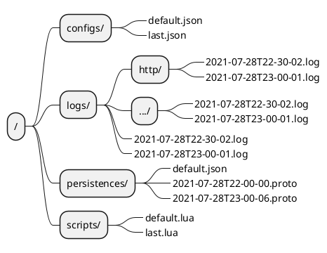

# Semi-Structured Data Service

## 1. Program Structure

```plantuml
@startuml
ditaa
+-------------------------------------+
|        interface / log / ...        | framework
+-------------------------------------+
| config / log / persistence / script | engine
+-------------------------------------+
@enduml
```

## 2. Framework

- interface
- log

## 3. Engine

- config
- log
- persistence
- script

## 4. File


